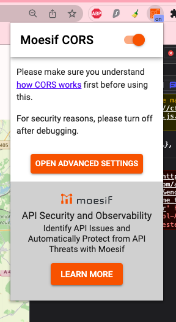
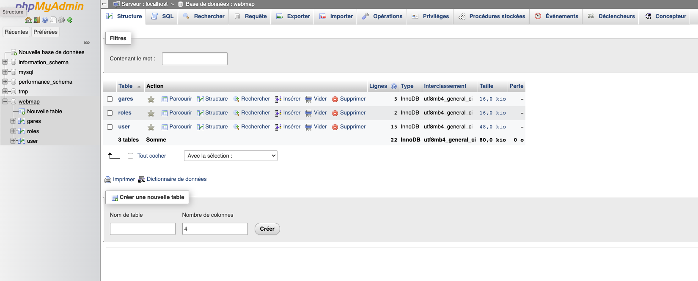

# WEB-MAP - [Félix LIBURSKI](https://github.com/felixlbr), [Hugo PEREIRA](https://github.com/tigrou23) & François PEUCH (novembre - janvier 2023)
<div align="justify">
	Dans ce projet universitaire, nous avons utilisé des APIs pour tracer et indiquer un itinéraire en temps réel entre deux gares d'Île-de-France. Des fonctionnalités supplémentaires ont été ajoutées et décrites ci dessous.
</div>
<br>

Lien vers le site :
- https://hugopereira.fr

## <center>Table des matières</center>
* [Prérequis pour pouvoir utiliser correctement notre site](#chapter1)
	* [Cross-origin resource sharing](#section1_1)
	* [Erreur détectée](#section1_2)
	* [Correction de l'erreur](#section1_3)


* [Fonctionnalités détaillées](#chapter2)
 	* [Transports disponibles](#section2_1)
 	* [Inscription & Connexion](#section2_2)
	* [Stations préférées](#section2_3)
	* [Détails du trajet](#section2_5)
	* [Météo disponible sur les stations](#section2_6)
	* [Modification possible des données](#section2_7)

* [Les APIs utilisées](#chapter3)
 	* [OpenWeather](#section3_1)
	* [opendata](#section3_2)
	* [citymapper](#section3_3)

* [Structure du projet](#chapter4)
	* [PHP/SQL](#section4_1)
	* [Javascript/JQUERY](#section4_2)
	* [CSS](#section4_3)
	* [Base de données](#section4_4)

* [Architecture](#chapter5)
	* [Hébergement du projet](#section5_1)
	* [Hébergement de la base de données MySQL](#section5_2)
	* [Nom de domaine](#section5_3)
	* [Certificat SSL](#section5_4)

## Prérequis pour pouvoir utiliser correctement notre site <a class="anchor" id="chapter1"></a>

### 1. Cross-origin resource sharing <a class="anchor" id="section1_1"></a>

Nous vous proposons cette excellente vidéo qui explique clairement ce qu'est le *CORS* :
- https://www.youtube.com/watch?v=4KHiSt0oLJ0

### 2. Erreur détectée <a class="anchor" id="section1_2"></a>

Pour toute recherche d'un trajet, la requête vers le serveur de Citymapper ne fonctionnera pas :


### 3. Correction de l'erreur <a class="anchor" id="section1_3"></a>

Pour corriger l'erreur, il suffira d'installer l'extension Google *Moesif Origin & CORS Changer* : [Extension à installer](https://chrome.google.com/webstore/detail/moesif-origin-cors-change/digfbfaphojjndkpccljibejjbppifbc?hl=en-GB).

Une fois activée, l'extension vous permettra de faire les requêtes que vous souhaitez. 



⚠️ Attention, il est tout de même possible qu'aucun trajet ne vous soit proposé si vous utilisez le site dans la nuit (pas de transports a proposé car temps réel).
	
## Fonctionnalités détaillées <a class="anchor" id="chapter2"></a>

### 1. Transports disponibles <a class="anchor" id="section2_1"></a>
Les trajets proposés par WEB-MAP concernent :
- Train 🚅
- RER 🚈
- Métro 🚇
- Tramway 🚃
- Bus 🚎
<div align="justify">
Afin de simplifier l'identification de chaque ligne, elles sont identifiables (sur la carte et dans le détail des itinéraires) par leurs propres couleurs (ex: jaune pour la ligne 1 du métro).
</div>
<br>

### 2. Inscription & Connexion <a class="anchor" id="section2_2"></a>
<div align="justify">
Un formulaire de connexion et un autre d'inscription vous permettent de vous connecter et d'accéder à la page <a href="itineraire.php">itinéraire</a> (⚠️ Seules les personnes connectées peuvent accéder à cette page.).
</div>
<br>

À l'inscription, nous obligeons l'utilisateur à utiliser un mot de passe composé au minimum de 8 caractères.


### 3. Stations préférées <a class="anchor" id="section2_3"></a>
<div align="justify">
	Chaque utilisateur peut définir une station <i>home</i> et une station <i>work</i>. Ces stations seront proposées à l'utilisateur pour lui apporter une expérience personnalisée.
</div>
<br>


### 5. Détails du trajet <a class="anchor" id="section2_5"></a>
<div align="justify">
Pour chaque trajet proposé, un détail est disponible sur une fenêtre pour apporter plus de précision sur le transport en question ainsi que les gares à emprunter.
</div>
<br>


### 6. Météo disponible sur les stations <a class="anchor" id="section2_6"></a>
<div align="justify">
Nous marquons sur la carte les gares principales (gare de départ et gare d'arrivée pour chaque transport de l'itinéraire). Lorsqu'on clique sur ces dernières, il nous est renseigné le nom ainsi que la météo correspondante.
</div>
<br>


### 7. Modification possible des données <a class="anchor" id="section2_7"></a>
<div align="justify">
Un formulaire de connexion et un autre d'inscription vous permettent de vous connecter et d'accèder à la page itineraire.php.
</div>
<br>


## Les APIs utilisées <a class="anchor" id="chapter3"></a>

### 1. OpenWeather <a class="anchor" id="section3_1"></a>
<div align="justify">
Lien vers le site de l'entreprise : <a href="https://openweathermap.org/api">OpenWeather</a>
<br><br>
Nous récupérons de cette API la météo pour un point géographique donné. Cela nous permet d'ajouter la température pour les gares cliquées
</div>
<br>

### 2. Open Data Hauts de Seine <a class="anchor" id="section3_2"></a>
<div align="justify">
Lien vers le site de l'entreprise : <a href="https://opendata.hauts-de-seine.fr/">Open Data Hauts de Seine</a>
</div>
<br>

API utilisée pour deux choses :
- Récupérer toutes les gares afin de les lister et aider l'utilisateur à trouver sa destination.
- Récupérer les tracés des lignes que l'on cherche. L'API renvoie un tableau de coordonnées qu'on va utiliser pour tracer à l'aide de polylines le parcours de la ligne concernée.

### 3. Citymapper <a class="anchor" id="section3_3"></a>
<div align="justify">
Lien vers le site de l'entreprise : <a href="https://docs.external.citymapper.com/api/
">Citymapper</a>
</div>
<br>
Cette API est sans doute la plus importante de notre projet. Elle permet de nous délivrer le chemin entre deux points donnés. Nous trions ensuite les données JSON pour retirer tous trajets à vélo ou à pied. Ce sont avec ces données que nous traçons le trajet et que nous délivrons tous les détails du parcours.
</div>
<br>

## Structure du projet <a class="anchor" id="chapter4"></a>

**Toutes nos fonctions JavaScript sont documentées ✅.**

### 1. PHP/SQL <a class="anchor" id="section4_1"></a>
Nous avons séparé en 2 types de catégories les fichiers PHP :<br><br>
**Fichier template :**<br>
Il est principalement composé en HTML. Le fichier template est la structure de la page mais pour pouvoir gérer les sessions connectées, nous avons eu besoin d'insérer du PHP. L'en-tête et des bouts du fichiers sont en PHP. <br><br>
**Fichier de connexion :**<br>
Il a une fonction bien particulière :
<ul>
	<li><b>connect.php</b> : Met en connexion notre site avec la base de données. On y trouve les paramètres de connexion ainsi que la fonction de connexion. L'appel de fichier est nécessaire dans les autres fichiers PHP avant nos requêtes SQL.
	<li><b>envoieConnexion.php</b> : Vérifie avec la base de données si l'email de l'utilisateur existe. Ce fichier est utilisé lors de la connexion au site web. Nous vérifions l'information avec une requête <i>SELECT</i>. Si l'utilisateur a les paramètres d'administrateur, la page renvoyée est celle pour administrer la base de données. 
	<li><b>envoieInscription.php</b> : Inscrit un nouvel utilisateur dans la base de données. Nous utilisons une requête <i>INSERT</i>. Les valeurs dans la colonne <i>Work</i> et <i>Home</i> sont à <i>Null</i> par défaut. L'utilisateur a le rôle <i>utilisateur</i> lorsqu'il s'inscrit.
	<li><b>envoieProfile.php</b> : Permet de récolter les données d'un utilisateur à partir de son email. Ce fichier est utilisé lorsque l'utilisateur connecté affiche les détails de son profil. En ayant récupéré seulement son email et son mot de passe de connexion, la fonction du fichier va chercher les informations complémentaires de l'utilisateur. Nous utilisons une requête <i>SELECT</i> sur le mail de la personne connectée.
	<li><b>envoieCompte.php</b> : Permet de modifier les informations de l'utilisateur. Ce fichier est utilisé lorsque l'utilisateur veut modifier certaines informations de son compte. Il ne peut juste pas modifier son adresse mail qui sert de clé dans la base de données. Nous utilisons une requête <i>UPDATE</i>.
	<li><b>logout.php</b> : Permet de déconnecter un utilisateur. Le lien de déconnexion est utilisé sur toutes les pages du site et permet de détruire la session active.
</ul>

### 2. Javascript/JQUERY <a class="anchor" id="section4_2"></a>
Nous avons deux fichiers JavaScript/JQUERY qui gèrent l'aspect algorithmique de notre projet :
- [script.js](./js/script.js)
- [itineraire.js](./js/script.js)

*script.js* va s'occuper, entre autres, de faire les requêtes. Le fichier *itineraire.js* va davantage servir à gérer l'aspect événementiel. Par exemple à la validation :

```js
$('#valider').click(function () {
    $('#itineraire').hide()
    $('#chemin').show()
    let index = getIndex($('#departChoix').val())
    let coordonneesDepart = villes[index].fields.geo_point_2d
    index = getIndex($('#arriveeChoix').val())
    let coordonneesArrivee = villes[index].fields.geo_point_2d
    tracerTrajet(coordonneesDepart, coordonneesArrivee)
})
```

De plus, nous avons utilisé les fichiers *.js* pour éviter la redondance de code. Cela facilite grandement la maintenance. Nous pouvons prendre l'exemple du fichier [footer.js](./js/footer.js) qui nous permet d'ajouter le même footer à toutes les pages dynamiquement.

**Toutes nos requêtes sont effectuées via AJAX, par exemple pour Citymapper :**
```js
/**
 * Affiche une ligne
 * @param type type de la ligne (RER, TRAIN...)
 * @param ligne la ligne en question (C, N...)
 */
function afficherLigne(type, ligne, couleur){
    let cpt=0;
    let base = 0;
    do{
        $.ajax({
            method: 'GET',
            url: "https://opendata.hauts-de-seine.fr/api/records/1.0/search/?dataset=traces-du-reseau-de-transport-ferre-dile-de-france&q=&facet=mode&facet=indice_lig&refine.mode="+ type.toUpperCase().trim() + "&refine.indice_lig=" + ligne.toUpperCase().trim() + "&rows=100&start=" + base*100,
            success : function(data){
                cpt = data.parameters.rows;
                tracerLigne(data, couleur);
            },
        });
        ++ base;
    }while(cpt!==0);
}
```

Nous avons également utilisé des fichiers *js* comme [itineraire.js](./js/).

### 3. CSS <a class="anchor" id="section4_3"></a>
<div align="justify">
Nous avons utilisé 3 fichiers CSS pour habiller notre site web :<br>
<ul>
	<li>connexion_style.css : permet d'habiller la page de connexion.
	<li>itineraire_style.css : permet d'habiller la page itinéraire.
	<li>style.css : rajouter un loader.
</ul>
Les fichiers CSS permettent de rendre notre site web responsive. Il y a une version ordinateur et une version mobile. La version mobile est essentielle pour la cohérence d'un projet abouti. En effet, notre site permet de trouver un itinéraire pour se déplacer. Cette consultation se fait principalement sur un téléphone, lorsque nous n'avons pas accès à notre ordinateur. Il était donc pour nous essentiel de développer cette version réduite pour les smartphones. Concernant le code CSS, nous avons utilisé une méthode de développement web : les variables. 
Le fichier CSS est alors plus lisible ce qui permet de travailler à plusieurs très facilement.
</div>
<br>

### 4. Base de données <a class="anchor" id="section4_4"></a>

**Le mot de passe de chaque utilisateur est crypté, ce qui signifie que dans la base de donnée, aucun mot de passe n'est en clair. Nous avons utilisé la fonction java ```MD5()```. Lors de l'authentification d'un utilisateur, nous vérifions le mot de passe saisie crypté et le mot de passe crypté de la base de donées ✅.**

3 tables sont utilisées dans notre projet :
- *gare* : liste des gares à utiliser.
- *user* : Garder toutes les informations de connexion des utilisateurs.
- *roles* : gérer les rôles des utilisateurs de l'application.

**La table *gare* n'est plus utilisée**. En effet, il était trop lourd de stocker les 400 gares disponibles et pas assez proche de la réalité. C'est-à-dire que si une gare est supprimée, on ne souhaite pas qu'elle soit proposée à l'utilisateur. C'est pourquoi nous utilsons à la place une API qui nous livre les gares en format JSON.

La table *gare* est composée de plusieurs champs :
- id (primary key)
- libelle

La table *user* est composée de plusieurs champs :
- id (primary key)
- prenom
- nom
- password
- email (unique)
- home
- work
- roles (foreign key de Roles(id))

La table *roles* est composée de plusieurs champs :
- id (primary key)
- libelle

Chaque utilisateur a un rôle. Pour l'instant nous avons implémenté deux rôles :
- standard
- admin

Si une personne a le rôle admin, elle pourra accéder à la configuration de notre base sur *PHPMyAdmin*.

Un utilisateur lambda sera renvoyé vers le choix de l'itinéraire.

## Architecure <a class="anchor" id="chapter5"></a>

### 1. Hébergement du projet <a class="anchor" id="section5_1"></a>
<div align="justify">
Le projet est hébergé en ligne et donc accessible avec un accès internet. 
</div>
<br>

Lien vers le site :
- https://hugopereira.fr

<div align="justify">
Nous accèdons au VPS (<i>Virtual Private Server</i>) via le protocole SSH (<i>Secure Shell</i>). De ce fait, nous avons mis en place un serveur Apache2 et cloné notre répertoire GitHub. Cela nous permet de pull notre projet de manière automotisé avec un contrab (contrab permet d'exécuter des commandes périodiquement). 
</div>
<br>

### 2. Hébergement de la base de données MySQL <a class="anchor" id="section5_2"></a>
<div align="justify">
Voici le détail de notre installation de la base de données et de son accès via PhpMyAdmin.
</div>
<br>

```js
//Installation des packages nécessaires
apt-get install mariadb-server
mysql_secure_installation
apt-get install apache2
apt-get install php7.3 php-mysql php-xml
wget du lien de phpmyadmin
tar xvf de l’archive

//Modifier le bind :
nano /etc/mysql/mariadb.conf.d/50-server.cnf

//Paramétrage de la base
mysql -p
create database webmap;
CREATE USER ‘webmap’@‘%’ IDENTIFIED BY ‘IUT_75’;
GRANT ALL PRIVILEGES ON webmap.* TO 'webmap'@'%' WITH GRANT OPTION;
GRANT ALL PRIVILEGES ON *.* TO root@localhost IDENTIFIED BY ‘****’ with GRANT OPTION; 
GRANT ALL PRIVILEGES ON webmap.* TO webmap@localhost IDENTIFIED BY ‘IUT_75’ with GRANT OPTION; 
FLUSH Privileges

//Update des changements
systemctl restart mariadb
```

<div align="justify">
<b>Avec l'association entre Apache2 et PhpMyAdmin, nous pouvons accéder à l'interface de PhpMyAdmin depuis n'importe quel endroit.</b>
</div>
<br>

Adresse de la base de données :
- http://82.165.187.129/



### 3. Nom de domaine <a class="anchor" id="section5_3"></a>
<div align="justify">
Un nom de domaine a été acheté sur IONOS pour pouvoir rendre l'accès à notre site plus simple. Il a suffit de paramétrer les champs du DNS pour pouvoir rediriger le flux vers l'adresse IP de notre serveur.
</div>
<br>

### 4. Certificat SSL <a class="anchor" id="section5_4"></a>
<div align="justify">
Nous avons généré un certificat SSL (<i>Transport Layer Security</i>) avec l'outil <i>Certbot</i>. Cet outil est un package que l'on peut télécharger sur Linux en spécifiant le site Apache2 à certifier. De ce fait, notre site est à la fois accessible par le protocole HTTP et HTTPS.
</div>
<br>
