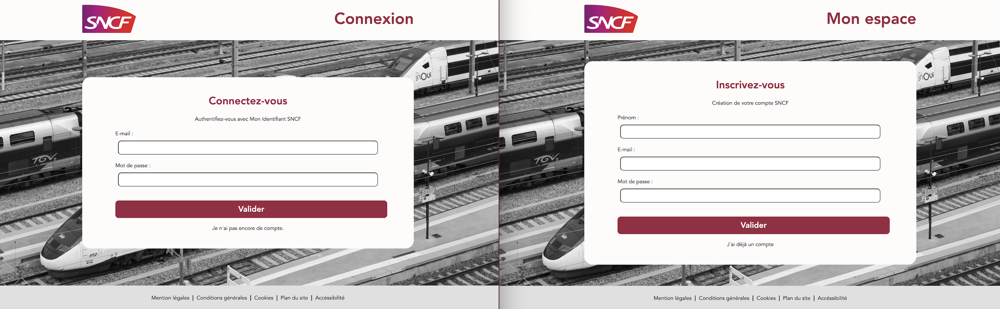
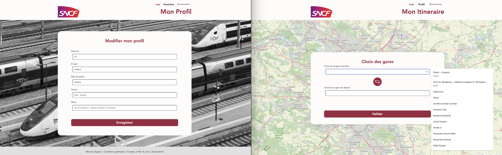
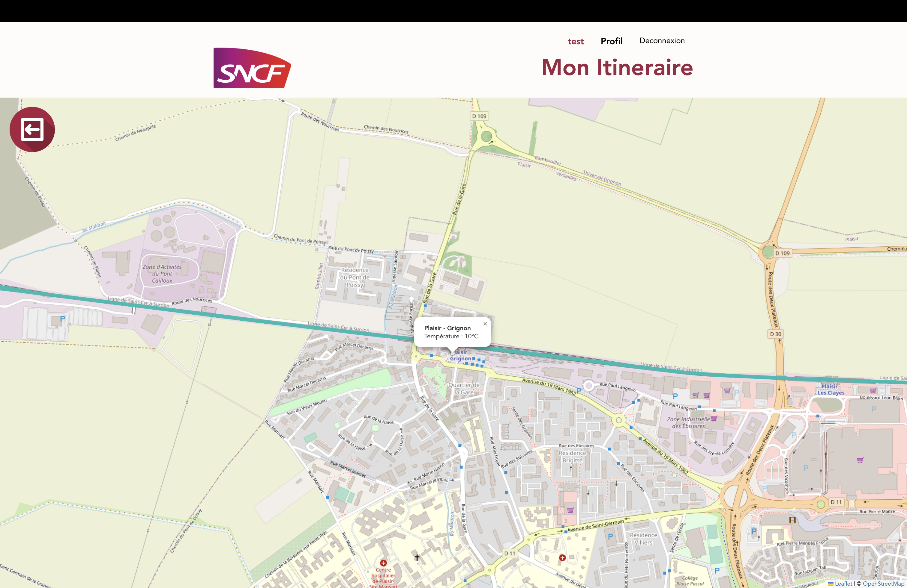
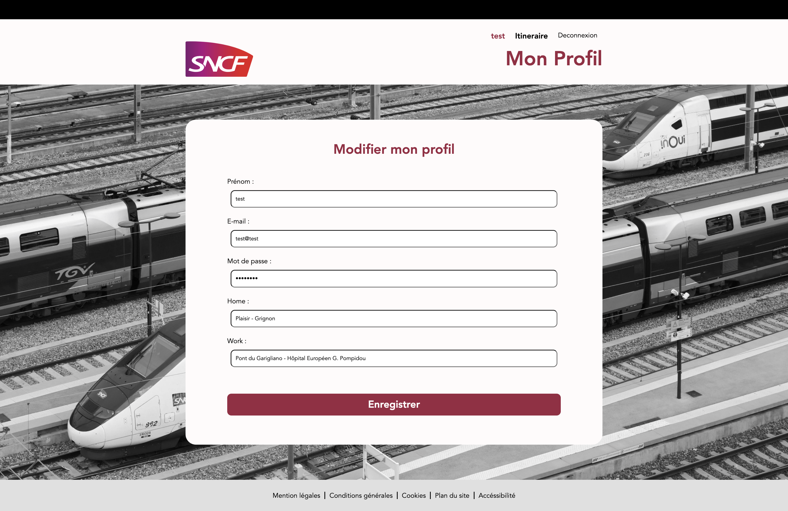

# WEB-MAP - [Félix LIBURSKI](https://github.com/felixlbr), [Hugo PEREIRA](https://github.com/tigrou23) & François PEUCH (novembre - janvier 2023)

	Dans ce projet universitaire, nous avons utilisé des APIs pour tracer et indiquer un itinéraire en temps réel entre deux gares d'Île-de-France. Des fonctionnalités supplémentaires ont été ajoutées et décrites ci dessous.

## 
Table des matières

* [Prérequis pour pouvoir utiliser correctement notre site](#chapter1)
	* [Cross-origin resource sharing](#section1_1)

* [Fonctionnalités détaillées](#chapter2)
 	* [Transports disponibles](#section2_1)
 	* [Inscription & Connexion](#section2_2)
	* [Stations préférées](#section2_3)
	* [Détails du trajet](#section2_5)
	* [Météo disponible sur les stations](#section2_6)
	* [Modification possible des données](#section2_7)

* [Les APIs utilisées](#chapter3)
 	* [OpenWeather](#section3_1)
	* [opendata](#section3_2)
	* [citymapper](#section3_3)

* [Structure du projet](#chapter4)
	* [PHP/SQL](#section4_1)
	* [Javascript/JQUERY](#section4_2)
	* [CSS](#section2_3)
	* [Base de données](#section4_3)

* [Architecture](#chapter5)
	* [Hébergement du projet](#section5_1)
	* [Hébergement de la base de données MySQL](#section5_2)
	* [Nom de domaine](#section5_3)
	* [Certificat SSL](#section5_4)
	
## Fonctionnalités détaillées 

### 1. Transports disponibles 
Les trajets proposés par WEB-MAP concernent :
- Train 🚅
- RER 🚈
- Métro 🚇
- Tramway 🚃
- Bus 🚎

Afin de simplifier l'identification de chaque ligne, elles sont identifiables (sur la carte et dans le détail des itinéraires) par leurs propres couleurs (ex: jaune pour la ligne 1 du métro).

 

### 2. Inscription & Connexion 

Un formulaire de connexion et un autre d'inscription vous permette de vous connecter et d'accèder à la page <a href="itineraire.php">itinéraire</a> (⚠️ Seules les personnes connectées peuvent accéder à cette page.).

 

### 3. Stations préférées 

	Chaque utilisateur peut définir une station <i>home</i> et une station <i>work</i>. Ces stations seront proposées à l'utilisateur pour lui apporter une expérience personnalisée.

 

### 5. Détails du trajet 

Pour chaque trajet proposé, un détail est disponible sur une fenêtre pour apporter plus de précision sur le transport en question ainsi que les gares à emprunter.

 

### 6. Météo disponible sur les stations 

Nous marquons sur la carte les gares principales (gare de départ et gare d'arrivée pour chaque transport de l'itinéraire). Lorsqu'on clique sur ces dernières, il nous est renseigné le nom ainsi que la météo correspondante.

 

### 7. Modification possible des données 

Un formulaire de connexion et un autre d'inscription vous permette de vous connecter et d'accèder à la page itineraire.php.

 

## Les APIs utilisées 

### 1. OpenWeather 

Lien vers le site de l'entreprise : <a href="https://openweathermap.org/api">OpenWeather</a>
 
Nous récupérons de cette API la météo pour un point géographique donné. Cela nous permet d'ajouter la température pour les gares cliquée.

 

### 2. Open Data Hauts de Seine 

Lien vers le site de l'entreprise : <a href="https://opendata.hauts-de-seine.fr/">Open Data Hauts de Seine</a>

 

API utilisée pour deux choses :
- Récupérer toutes les gares afin de lister les gares et aider l'utilisateur à trouver sa destination.
- Récupérer les tracés des lignes que l'on cherche. L'API renvoie un tableau de coordonnées qu'on va utiliser pour tracer à l'aide de polyline le parcours du la ligne concernée.
 

### 3. Citymapper 

Lien vers le site de l'entreprise : <a href="https://docs.external.citymapper.com/api/
">Citymapper</a>

 
Cette API est sans doute la plus importante de notre projet. Elle permet de nous délivrer le chemin entre deux points donnés. Nous trions ensuite les données JSON pour retirer tous trajets à vélo ou à pied. Ce sont avec ses données que nous traçons le trajet et que nous délivrons tous les détails du parcours.

 

## Structure du projet 

### 1. PHP/SQL 

à rédiger

 

### 2. Javascript/JQUERY 

à rédiger

 

### 3. CSS 

à rédiger

 

### 4. Base de données 

à rédiger

 